<div align="center">
  <a href="https://github.com/Anandpall">
    
  </a>

  <h1>ANAND PAL</h1>

  <p>
    <b>Where cryptic terminals meet data science, systems engineering & agentic vibecoding.</b><br />
    1st Year CSE (Data Science) @ JSS University • Tinkering with computers since 2012 • Ricing Omarchy Linux
  </p>

  <p>
    <a href="https://github.com/Anandpall"></a>
    <a href="https://github.com/Anandpall"></a>
    <a href="https://github.com/Anandpall"></a>
    <a href="https://github.com/Anandpall"></a>
    <a href="https://github.com/Anandpall"></a>
  </p>

  <p>
    <a href="https://github.com/Anandpall">
      
    </a>
  </p>
</div>

---

## ⚡ GitAscii Dynamic Telemetry Deck

<!-- GitAscii Edge-Rendered Dynamic Profile SVG -->
<div align="center">
  <a href="https://gitascii.com">
    
  </a>
  <p align="center">
    <sub>Layout configured via <a href="./gitascii.json"><b><code>gitascii.json</code></b></a> • Powered by <a href="https://github.com/Igorcbraz/GitAscii"><b>GitAscii</b></a> edge compiler</sub>
  </p>
</div>

---

## 🔄 Pipeline & Flow Architecture

```mermaid
flowchart LR
    A["💡 Flow & Ideas<br/>(Late-Night Spark)"] -->|"Vibecoding"| B["⚡ Agentic Prototyping<br/>(Cursor / Neovim)"]
    B -->|"Compile & Build"| C["🛠️ Systems & Data Stack<br/>(.NET 8 / PyTorch / C++)"]
    C -->|"Deploy & Rice"| D["🖥️ Omarchy Linux<br/>(Hyprland + Quickshell)"]
    D -->|"Ship to World"| E["🚀 Shipped Software<br/>(Lmen, Nitro-Checker & Tools)"]

    style A fill:#1f1f1f,stroke:#c5ff4a,stroke-width:1px,color:#ffffff
    style B fill:#060606,stroke:#252525,stroke-width:1px,color:#c5ff4a
    style C fill:#1f1f1f,stroke:#252525,stroke-width:1px,color:#ffffff
    style D fill:#1f1f1f,stroke:#c5ff4a,stroke-width:2px,color:#ffffff
    style E fill:#060606,stroke:#c5ff4a,stroke-width:1px,color:#c5ff4a
```



---

## 🖥️ `$ fastfetch --profile`

```text
+-----------------------------------------------------------------------------------------+
|  anand@omarchy-box:~$ fastfetch --profile                                               |
+-----------------------------------------------------------------------------------------+
|         /\            USER        : Anand Pal (@Anandpall)                              |
|        /  \           COUNTRY     : India 🇮🇳                                            |
|       /\   \          TIMEZONE    : IST (UTC+05:30) • Asia/Kolkata                      |
|      /      \         HOST        : JSS University • CSE (Data Science, 1st Year)       |
|     /   ,,   \        OS          : Omarchy Linux [Arch-based x86_64]                   |
|    /   |  |  -\       UPTIME      : 14 Years (Tinkering with PCs since 2012)             |
|   /_-''    ''-_\      CODING      : Since 2022 (Hooked in 9th Grade)                    |
|                       WM / DE     : Hyprland + Quickshell [Custom Rice]                 |
|                       SHELL       : zsh 5.9 [omarchy-rice]                              |
|                       TERMINAL    : Kitty / WezTerm                                     |
|                       EDITORS     : Cursor / Neovim / VS Code                           |
|                       GITHUB      : github.com/Anandpall (Member since Jan 2024)        |
|                       PHILOSOPHY  : "Do it with style, vibecode the rest."              |
+-----------------------------------------------------------------------------------------+
```

---

## 📜 `$ cat ~/.timeline.log`

```bash
[2012] 🕹️  BOOTSTRAP       First touched computers as a kid in India. Fell in love with PC hardware.
[2022] ⚡  INIT_PROGRAM     Discovered programming in 9th grade. Wrote logic, automation & scripts.
[2024] 🌐  GITHUB_JOIN     Joined GitHub (@Anandpall). Began publishing tools & utilities.
[2026] 🎓  UNDERGRAD        1st Year CSE (Data Science) @ JSS University. ML, math models & flow.
[NOW]  🚀  PRODUCTION       Vibecoding experimental desktop tools, ricing Linux, and shipping fast.
```

---

## 🛠️ Technical Arsenal & Weaponry

<p>
  <b>Languages & Core Systems</b><br />
  
  
  
  
  
  
</p>

<p>
  <b>Data Science & Machine Learning</b><br />
  
  
  
  
  
</p>

<p>
  <b>Rice, Environment & Workflow</b><br />
  
  
  
  
  
  
</p>

---

## 🌟 `$ ls -la ~/projects/featured`

| Repository | Primary Language | Description & Highlights | Stack | Status |
| :--- | :--- | :--- | :--- | :--- |
| 🪟 [**lmen-for-windows**](https://github.com/Anandpall/lmen-for-windows) | `C#` | **Ambient screen-edge lighting & real-time synced lyrics companion for Windows**. Inspired by macOS Lumen, rebuilt for Windows with WASAPI audio loopback & FFT beat reactivity. 100% vibecoded weekend project. | `C#` `.NET 8` `WPF` `NAudio` `Win32` | `ACTIVE POLISH` |
| 🛡️ [**Disocrd-Nitro-Checker**](https://github.com/Anandpall/Disocrd-Nitro-Checker) | `Python` | High-speed multi-threaded validation and network automation utility for generating and checking Nitro gift codes with proxy rotation. | `Python` `Network` `Threading` | `STABLE` |
| ⚡ [**Anandpall**](https://github.com/Anandpall/Anandpall) | `Markdown` | Personal GitHub profile README and dynamic telemetry deck engineered with GitAscii terminal aesthetics and telemetry widgets. | `GitAscii` `Mermaid` `SVG` `JSON` | `MAINTAINED` |

---

## 📊 `$ gh telemetry --theme=gitascii-dark`

<div align="center">
  
  
</div>

<div align="center">
  <br />
  
</div>

---

<div align="center">

```bash
anand@omarchy-box:~$ echo "Stay curious. Keep building. Keep ricing."
anand@omarchy-box:~$ exit 0
```

<sub>Engineered with design obsession & terminal aesthetics by <a href="https://github.com/Anandpall"><b>@Anandpall</b></a> • India 🇮🇳 • Built with <a href="https://github.com/Igorcbraz/GitAscii"><b>GitAscii</b></a></sub>

</div>
